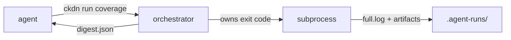

# ckdn

**ckdn** (short for **checkdown**) is a deterministic verification boundary
between a coding agent and your project's tools. The agent never reads a
10 000-line pytest log and never decides from prose whether a run "looks
green".

Every check goes through one orchestrator that:

1. owns the true process exit code,
2. archives the full log as evidence,
3. emits a **bounded, machine-readable digest** — the only thing the agent is
   supposed to read.

Runtime: Python ≥ 3.11, **stdlib only** for the core CLI (zero third-party
dependencies). The optional [MCP server](agents-mcp.md#mcp) is an extra
(`ckdn[mcp]`).

## Why

Letting an agent interpret raw tool output fails in two directions:

1. **Context bloat** — a full coverage run with `term-missing` is thousands of
   lines. The agent burns context on noise and misses the signal.
2. **False green** — text-based interpretation invites the worst failure mode:
   a collection error produces no `FAILED` lines, a regex finds nothing, and
   the run is reported clean.

ckdn's answer is a strict status model from *both* the exit code and a
format-aware parser. The two must agree before anything is called green. ckdn
may **downgrade** green; it never **upgrades** red.

## How it fits together

- The orchestrator runs the configured command **without a shell**, captures
  its exit code and log, and reconciles them into one [status](status-model.md).
- Facts land in a compact [digest](digests.md) with a published JSON Schema.
- Policy (what to *do* about a failure) lives in a skill or `CLAUDE.md`, never
  in the data file.

## Next steps

- [Get started](get-started.md) — install and run your first check.
- [Status model](status-model.md) — how exit code × parser become one verdict.
- [Digests & schemas](digests.md) — the machine-readable contract.
- [Agents & MCP](agents-mcp.md) — wire ckdn into an agent loop.
